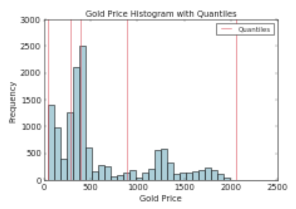
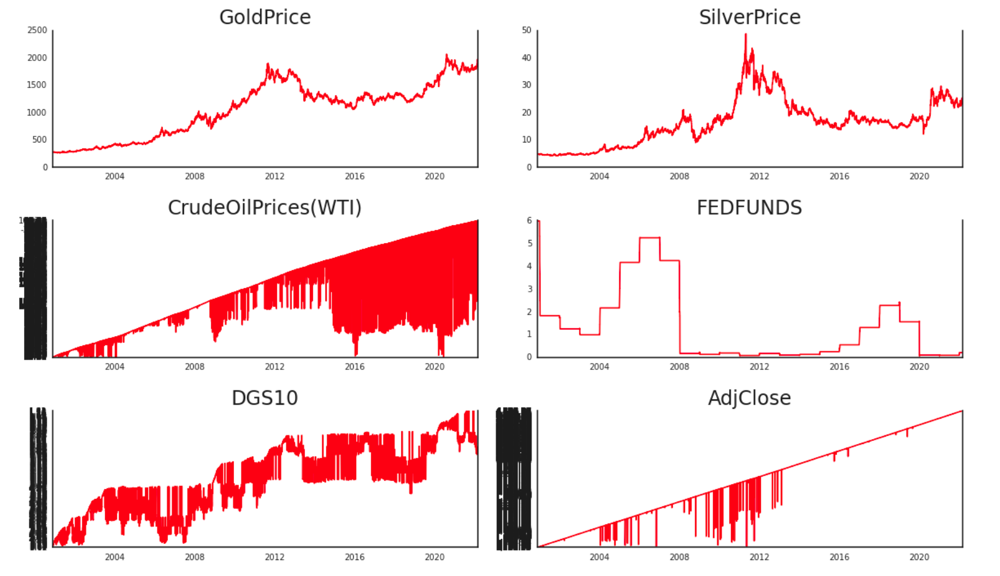
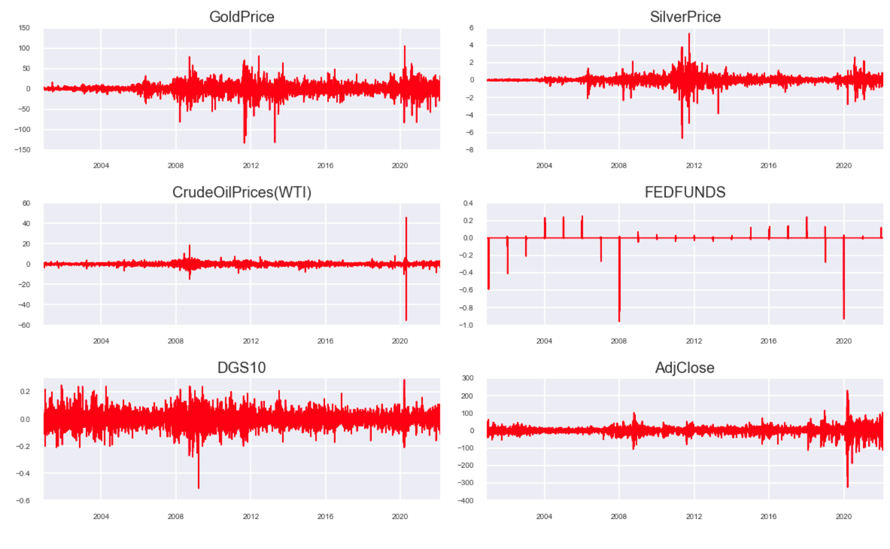

# VAR Price Prediction
Using a Time Series M.L model to estimate price of Gold and Oil on an updated dataset of Fed. Prices for these and other valuable commodities. 

> Data source: CMPE 256 Professor Chandrasekar Vuppalapati
Example outputs below that were part of the Exploratory Data Analysis 

Price Histogram with Quantiles

Line Plot of Price over Time by Commodity

Stationary Check

